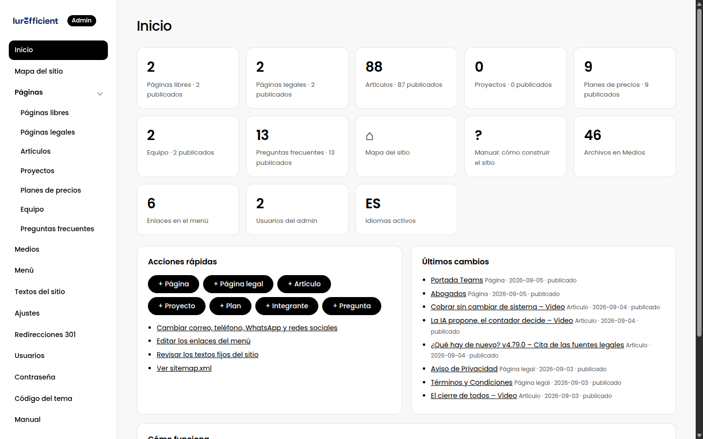

# 1. Bienvenida: qué es este panel y cómo pensarlo

> Las tres ideas que explican todo lo demás, y un recorrido por el panel en dos minutos.

## La idea central

Este sistema separa dos trabajos que en otros gestores se mezclan:

- **Quien escribe decide qué va en la página y en qué orden.** Añade secciones, escribe textos, sube imágenes, publica.
- **Quien programa el tema decide cómo se ve.** Tipografía, colores, espacios, animaciones.

Por eso en el panel no encontrarás controles de "margen izquierdo" ni "color de este título". Encontrarás secciones con contenido y una pestaña de estilo con opciones acotadas, como el fondo de una paleta o el ancho. Esa restricción es a propósito: mantiene el sitio coherente y hace que editar sea rápido y sin miedo.

## Tres cosas que conviene saber

1. **Todo lo que editas se guarda en archivos**, dentro de la carpeta `data/` del sitio. No hay base de datos. Respaldar el sitio es copiar esa carpeta y `uploads/`. Cada guardado conserva la versión anterior.
2. **Nada se publica hasta que lo marcas como publicado.** Un borrador se puede ver con el enlace de vista previa, pero no aparece en el sitio ni en buscadores.
3. **El sitio es un árbol.** Hay una portada, páginas que cuelgan de la raíz o de otras páginas, y colecciones como artículos o planes. El Mapa del sitio lo dibuja completo.

## El panel en dos minutos

- **Inicio**: conteos, accesos rápidos y últimos cambios.
- **Contenido** (grupo plegable): cada colección de contenido (las páginas libres se arman con secciones; los artículos, con el editor visual; los planes, preguntas o integrantes son piezas que las páginas muestran), **Medios** (imágenes, PDF y video subidos) y el **Mapa del sitio**, el árbol de todo lo que responde en el sitio, con su estado; desde ahí se crean, mueven y publican páginas.
- **Diseño** (grupo): el tema y sus variaciones, el **Menú**, los **Textos del sitio** que no pertenecen a ninguna página, el **Código del tema** (solo para quien programa) e **Importar diseño** cuando el tema tiene constructor.
- **Ajustes** (grupo): la configuración general en pestañas (General, Contacto y redes, Marca y SEO, tema, un paquete por pestaña, Cookies), con un solo botón Guardar siempre a la vista; **Redirecciones 301** para que las URL viejas sigan funcionando; y las páginas de los paquetes que tienen una (Audio, Redacción IA).
- **Sistema** (grupo, plegado): Temas y paquetes, Respaldos, Usuarios (ahí cambias tu contraseña) y Actualizar.
- **Manual**: este texto.

## Cómo seguir

Si el sitio es nuevo, sigue el capítulo [Tu primer portal desde cero](cap:02-primer-portal). Si el sitio ya existe y solo vas a editar, ve directo a [Construir una página con secciones](cap:04-construir-paginas) y a [Artículos y el editor visual](cap:06-articulos-y-editor).
