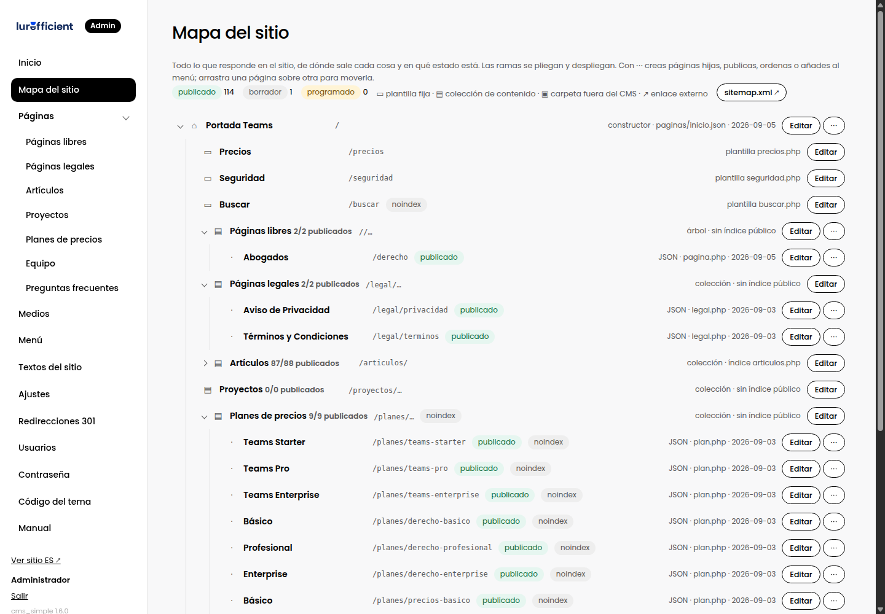

# 3. El mapa del sitio

> Cómo leer el árbol, y cómo crear, mover, ordenar y publicar páginas sin salir de él.

## Cómo leerlo

El mapa muestra todo lo que responde en el sitio, en forma de árbol:

- **⌂ La raíz** es la portada. Cuelgan de ella las páginas fijas del tema, las colecciones y las páginas libres.
- **▭ Plantilla fija**: una página que está programada en el tema, como Precios o Seguridad. Sus textos se editan en Textos del sitio.
- **▤ Colección**: un tipo de contenido, con sus elementos debajo. Muestra cuántos hay publicados.
- **▣ Carpeta fuera del CMS**: algo que vive junto al sitio pero no se edita aquí, como un centro de ayuda estático.
- **↗ Enlace externo** del menú.

Cada elemento lleva su estado: **publicado**, **borrador** o **programado** para una fecha. La etiqueta **noindex** significa que existe pero no se ofrece a los buscadores ni entra al sitemap; se usa en páginas de relleno, como el detalle de un plan que solo tiene sentido dentro de la página de precios.

A la derecha ves de dónde sale cada cosa y cuándo se editó por última vez.

## Crear páginas desde el mapa

El botón **+** de cada fila crea una página nueva en ese punto: en la raíz, en una colección, colgando de la página donde pulsas (su URL se forma con la ruta del padre, por ejemplo `/servicios/branding`) o dentro de una categoría.

El botón **⋯** abre el resto de acciones:

- **Nueva página hija** o **en la raíz** (lo mismo que +).
- **Publicar** o **Pasar a borrador**, sin abrir el editor.
- **Añadir al menú**, que crea el enlace en la cabecera con el título de la página.
- **Subir** o **Bajar entre hermanas**, que cambia el orden con el que se listan.
- **Eliminar**, con confirmación. La portada no se puede borrar; si la página tiene hijas, pasan al nivel superior. El mismo botón está al pie de la columna derecha del editor y en el listado de la colección.

## Mover una página

Arrastra una página y suéltala sobre otra: pasa a ser su hija, y todas sus descendientes se mueven con ella. Suéltala sobre la colección para llevarla a la raíz. El sistema recalcula las rutas y no permite meter una página dentro de sí misma.

Después de mover una página cuya URL ya estaba publicada, crea una redirección en **Redirecciones 301** de la ruta vieja a la nueva. Así no se pierden los enlaces que ya existían fuera del sitio.

## URL reservadas

En la raíz no se puede usar una URL que ya ocupa otra sección, como `/articulos` o `/precios`. El panel lo avisa. Si necesitas ese nombre, ponla debajo de una página padre.

## Categorías en el mapa

Cuando una colección usa categorías, cada una es una rama de la colección con sus elementos debajo, y su URL es una subsección real (`/articulos/derecho/`). Con ⋯ sobre la categoría se crea un elemento ya asignado a ella o se salta a **Diseño → Categorías** para renombrarla, fusionarla u ordenarla. Lo que no tiene categoría queda al final de la colección.
