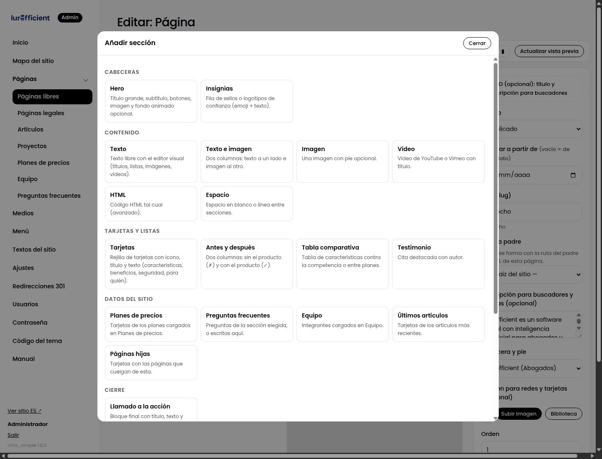
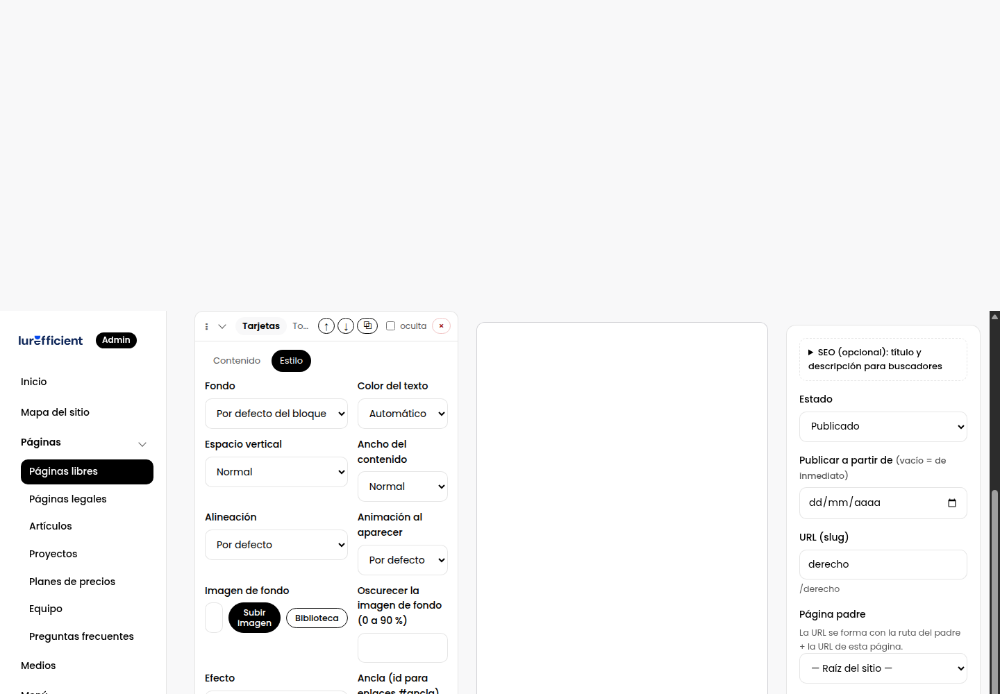

# 4. Construir una página con secciones

> El constructor: añadir secciones, escribir su contenido, ajustar su estilo y publicar con vista previa en vivo.

## La pantalla

Tres columnas:

- **Izquierda**: el título y la lista de secciones. Cada sección es una tarjeta plegable.
- **Centro**: la vista previa en vivo. Es tu sitio real, con su diseño, dibujando lo que estás editando aunque no lo hayas guardado. Se actualiza sola un instante después de cada cambio. Los botones de la barra superior la muestran en escritorio, tableta o móvil.
- **Derecha**: estado, fecha de publicación, URL, página padre, descripción para buscadores, imagen para redes, y el botón Guardar.

Un truco que ahorra tiempo: **haz clic en cualquier sección de la vista previa** y su tarjeta se abre a la izquierda. Y al contrario: al editar una tarjeta, la vista previa la resalta.

## Añadir una sección

Pulsa **Añadir sección**. El selector agrupa los bloques por lo que hacen: cabeceras, contenido, tarjetas y listas, datos del sitio, cierre, y los paquetes de efectos. Cada uno explica en una línea para qué sirve, y los que vienen de un paquete llevan su nombre al lado. Arriba hay un **buscador**: escribe "precios", "galería", "aviso" o el nombre de un paquete y solo quedan los bloques que coinciden; si queda uno, Enter lo añade. La sección nueva aparece al final; súbela con ⤒ (al principio), con las flechas, o arrástrala por el asa ⋮⋮: mientras arrastras, las tarjetas se pliegan y la página se desplaza sola si acercas el cursor al borde.

Una página bien construida suele tener entre cinco y diez secciones. Si pasa de doce, probablemente son dos páginas.

## Contenido

Cada tarjeta tiene dos pestañas. En **Contenido** están los campos del bloque: títulos, textos, listas, imágenes.

Convenciones que se repiten en todos los bloques:

- **Listas "una por línea"**: cada línea es un elemento. Cuando un elemento tiene varias partes, se separan con una barra vertical: `Título | Texto | icono`. El campo lo explica.
- **Títulos con resalte**: en los títulos puedes envolver una parte en `…` para que salga con el degradado de la marca. Es la única etiqueta que necesitas conocer.
- **Imágenes**: escribe el nombre, súbela con el botón, o elígela de la Biblioteca. Las imágenes se convierten a WebP solas.
- **Textos largos** usan el editor visual, explicado en [Artículos y el editor visual](cap:06-articulos-y-editor).

## Estilo

En **Estilo** están las opciones que el tema permite, iguales para todas las secciones:

| Opción | Para qué |
|---|---|
| Fondo | Un color de la paleta del sitio. La paleta la define el tema, así que todo combina. |
| Color del texto | Claro u oscuro, cuando el fondo lo requiere. Normalmente "automático" acierta. |
| Espacio vertical | Cuánto aire arriba y abajo. |
| Ancho del contenido | Estrecho para texto largo, ancho para galerías, todo el ancho para cintas. |
| Alineación | Izquierda, centro o derecha. |
| Animación al aparecer | Cómo entra la sección al hacer scroll. |
| Efecto | Efectos de los paquetes instalados, como texto revelado letra por letra o fondo animado. |
| Imagen de fondo y oscurecido | Una foto detrás del contenido, con un velo para que el texto se lea. |
| Ancla | El nombre para enlazar a esta sección con `#nombre`, por ejemplo desde un botón. |
| Ocultar en móvil | Para secciones que no aportan en pantallas pequeñas. |

Si una opción no aparece en un bloque es porque ese bloque no la admite; un hero, por ejemplo, controla su propio fondo.

## Herramientas de cada tarjeta

- **⤒ ↑ ↓ ⤓** cambian el orden: al principio, un lugar arriba, un lugar abajo, al final. También puedes arrastrar por el asa ⋮⋮.
- **⧉** duplica la sección con todo su contenido. Útil para repetir una estructura cambiando textos.
- **oculta** la guarda sin mostrarla. Sirve para desactivar algo temporalmente sin perderlo.
- **×** la quita. Puedes volver a añadir el bloque, pero el contenido se pierde.

## Publicar

- **Estado**: Borrador o Publicado. Guarda cuantas veces quieras como borrador; nadie lo ve.
- **Vista previa**: en un borrador, el botón "Vista previa" abre el sitio real con un enlace privado que puedes mandar a alguien para que revise.
- **Publicar a partir de**: una fecha futura deja la página lista pero oculta hasta ese día.
- **Versiones anteriores**, al pie de la columna derecha: cada guardado conserva la versión previa. Puedes restaurar cualquiera de las últimas diez.
- **Duplicar**, desde el listado de la colección: crea una copia como borrador para partir de ella.

## Consejos de composición

1. Empieza con un hero que diga en una frase qué es y para quién, y un solo botón principal.
2. Después del hero, responde "¿qué gano?" con tarjetas o un antes y después, no con una lista de funciones.
3. Una prueba: testimonio, cifras, logotipos de clientes.
4. Cierra siempre con un llamado a la acción. La gente que llegó hasta abajo quiere saber qué hacer.
5. Alterna fondos claros y oscuros para que las secciones se distingan al hacer scroll rápido.

## Colores y tipografías: dónde se editan

Hay dos niveles, y conviene tenerlos claros porque una página no tiene colores propios.

- **El sitio.** En **Ajustes → Diseño** están el color principal, el color de acento y la tipografía. Cambiarlos ahí cambia todo el sitio: botones, enlaces, degradados, títulos. Se eligen con un selector de color o escribiendo el valor hex, y el botón × vuelve al color original del tema. En sitios cuyo tema no tiene ese grupo, los colores viven en su hoja de estilos, editable desde Código del tema.
- **Cada sección.** En la pestaña **Estilo** de la sección se elige el fondo entre la paleta del sitio (blanco, gris claro, oscuro, color principal, degradado), el color del texto (automático, oscuro o claro), una imagen de fondo con su oscurecido, el espacio vertical, el ancho, la alineación y la animación. No hay un selector de color libre a propósito: así todas las páginas quedan en la misma familia de colores y un cambio en Ajustes las actualiza todas.

Si una sección necesita algo fuera de la paleta, la salida es el campo **Clases CSS adicionales** de Estilo con una regla en la hoja del tema, o el bloque HTML. El importador de diseños propone la paleta y las tipografías que ve en el PDF para que las lleves a Ajustes → Diseño.

## Cabeceras y pies con nombre (1.33)

**Diseño → Cabeceras y pies** guarda cabeceras y pies de página hechos con bloques, cada uno con su nombre. Sirve para tener varios en el mismo sitio (la cabecera de la marca principal y la de una línea de negocio, un pie corto para las páginas de campaña) y cambiarlos desde el panel sin tocar el tema.

1. Crea una pieza: nombre, si es cabecera o pie, y sus bloques. Lo normal es un solo bloque **Cabecera del sitio** (logotipo, menú, botón) o **Pie de página** (columnas, contacto, redes, derechos); puedes añadir más, por ejemplo una banda de aviso antes del menú o un llamado a la acción antes del pie. La vista previa la muestra puesta en una página de muestra del tema.
2. En el menú del bloque de cabecera, `@menu` pone el menú de Diseño → Menú; una línea que empieza con `- ` cuelga de la entrada anterior y forma un desplegable. En el pie, `@ajustes` en contacto y redes toma lo de Ajustes, y `{year}` en la línea de derechos pone el año.
3. Publica la pieza. Los borradores solo se ven en las vistas previas.
4. En el editor de cada página, en la barra lateral, elige **Cabecera** y **Pie de página**: la predeterminada, ninguna, o una por su nombre. **Ajustes → Cabeceras y pies del constructor** fija las predeterminadas para las páginas que no eligen.

Si una página no elige nada y no hay predeterminada, el tema pone su cabecera y su pie de siempre. Los temas que no llaman a `cms_layout_header()` y `cms_layout_footer()` en su `inc/layout.php` siguen igual; la vista previa de la pieza lo avisa (capítulo 10 para programadores).

## Tamaño de las imágenes y HTML a mano (1.34)

En la pestaña **Estilo** de una sección, "Ancho del contenido" cambia el ancho del contenedor (estrecho, normal, ancho, todo el ancho), no el de la imagen: una imagen más estrecha que el contenedor se queda igual. El tamaño de la imagen se elige en el propio bloque de imagen, en **Tamaño** (ancho del contenido, tamaño original, 320, 480, 720 o 960 px) y **Alineación**.

Cualquier sección se puede **convertir a HTML** con el botón `</>` de su tarjeta: se dibuja tal como se ve y se sustituye por un bloque **HTML libre** con ese código, que editas a mano. Es de ida: ya no tendrá campos ni pestaña de estilo (si guardas por error, restaura una versión anterior desde la columna derecha). El bloque HTML libre también sirve para pegar un incrustado o un mapa.

## Archivos y carpetas

**Contenido → Archivos y carpetas** gestiona carpetas propias en la raíz del sitio, fuera del CMS: una presentación, una landing hecha a mano, un micrositio. Cada carpeta responde en `/nombre/` con su `index.html`. Crea la carpeta, sube los archivos (o un zip con todo, que se descomprime con sus subcarpetas) y edita los de texto (HTML, CSS, JS…) con el editor de código, con respaldo en cada guardado. Se pueden renombrar y eliminar archivos y carpetas enteras. No se admiten archivos PHP ni tocar las carpetas del CMS.
